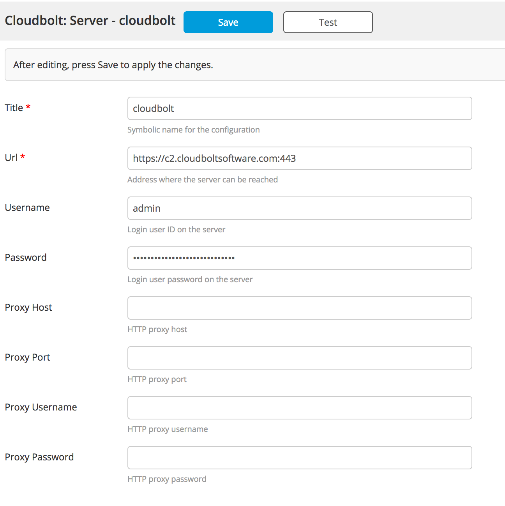
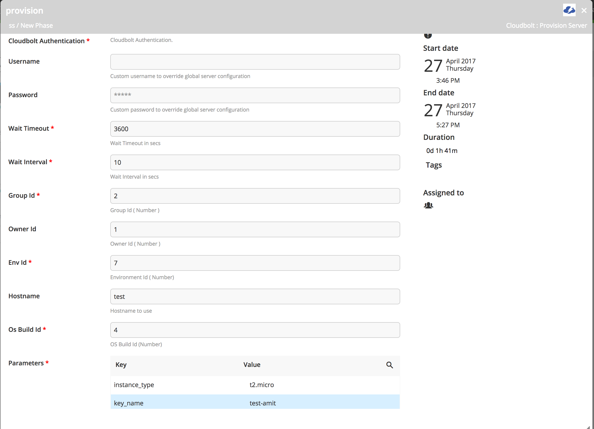
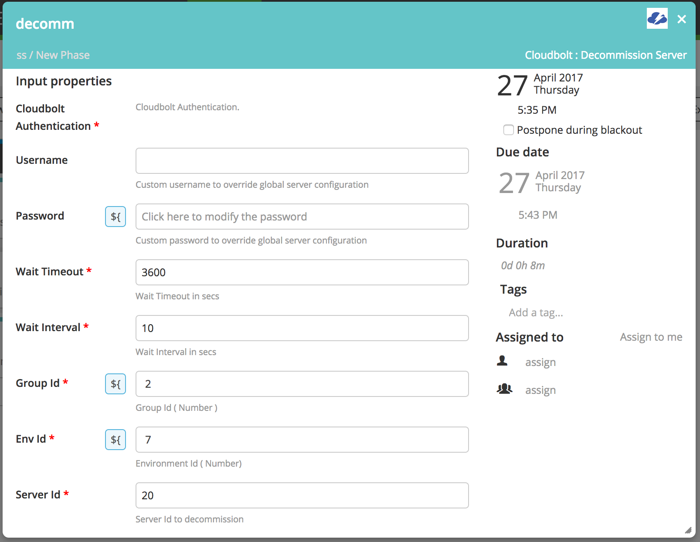

# xlr-cloudbolt-plugin

This plugin offers an interface from XL Release to Cloudbolt.io Provisioning API 

# CI status #

[![Build Status][xlr-cloudbolt-plugin-travis-image]][xlr-cloudbolt-plugin-travis-url]
[![Codacy Badge][xlr-cloudbolt-plugin-codacy-image] ][xlr-cloudbolt-plugin-codacy-url]
[![Code Climate][xlr-cloudbolt-plugin-code-climate-image] ][xlr-cloudbolt-plugin-code-climate-url]
[![License: MIT][xlr-cloudbolt-plugin-license-image] ][xlr-cloudbolt-plugin-license-url]
[![Github All Releases][xlr-cloudbolt-plugin-downloads-image] ]()

[xlr-cloudbolt-plugin-travis-image]: https://travis-ci.org/xebialabs-community/xlr-cloudbolt-plugin.svg?branch=master
[xlr-cloudbolt-plugin-travis-url]: https://travis-ci.org/xebialabs-community/xlr-cloudbolt-plugin
[xlr-cloudbolt-plugin-codacy-image]: https://api.codacy.com/project/badge/Grade/890de5bbae19495c9e8c8f9c36f40d4a
[xlr-cloudbolt-plugin-codacy-url]: https://www.codacy.com/app/amitmohleji/xlr-cloudbolt-plugin
[xlr-cloudbolt-plugin-code-climate-image]: https://codeclimate.com/github/xebialabs-community/xlr-cloudbolt-plugin/badges/gpa.svg
[xlr-cloudbolt-plugin-code-climate-url]: https://codeclimate.com/github/xebialabs-community/xlr-cloudbolt-plugin
[xlr-cloudbolt-plugin-license-image]: https://img.shields.io/badge/License-MIT-yellow.svg
[xlr-cloudbolt-plugin-license-url]: https://opensource.org/licenses/MIT
[xlr-cloudbolt-plugin-downloads-image]: https://img.shields.io/github/downloads/xebialabs-community/xlr-cloudbolt-plugin/total.svg

# Development #

* Start XLR: `./gradlew runDockerCompose`

# Type definitions #
+ `cloudbolt.ProvisionServer`: Helps in provisioning server through Cloudbolt
+ `cloudbolt.DecommissionServer`: Helps in decommissioning server through Cloudbolt
    
# Usage #
   
* Setup the server configuration

* Provision Server Task 

* Decommission Server Task

# References #
[CloudBolt API Docs](http://docs.cloudbolt.io/advanced/api/index.html)
[Python samples used for building plugin](http://docs.cloudbolt.io/static/CloudBolt_API_Samples.zip)

